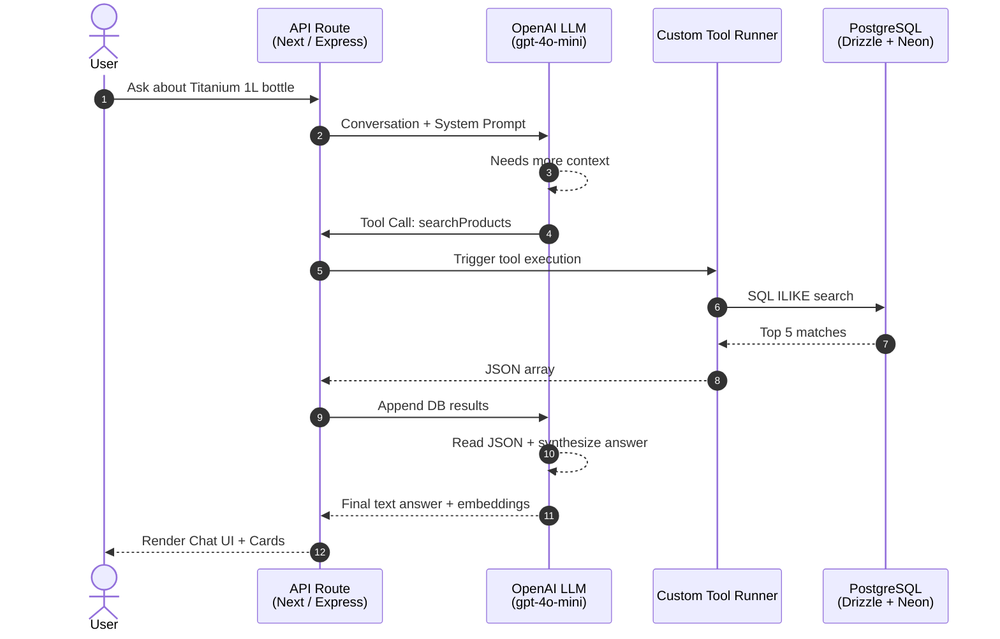
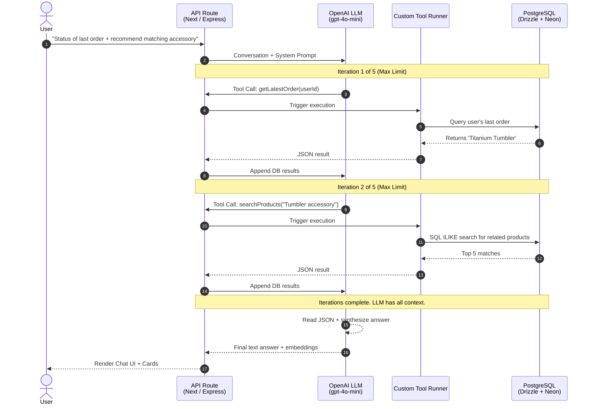

# Arctic - Smart Hydration E-Commerce

Arctic is an intelligent e-commerce application for premium hydration gear, powered by a custom-built, from-scratch AI architecture. 

**Live Demo**: [https://arctic.hrsht.me](https://arctic.hrsht.me)  
**Built By**: [Harshit](https://hrsht.me)  
**GitHub Repo**: [iBreakProd/Arctic-Support-Agent](https://github.com/iBreakProd/Arctic-Support-Agent)

---

## The AI Architecture: Raw Tool Runner Implementation

Unlike standard applications that rely on heavy frameworks like LangChain or LlamaIndex to blindly manage AI workflows, **Arctic features a completely raw, transparent implementation of an LLM Tool Runner.** 

The goal of this project was to deeply understand how Agentic AI actually works under the hood: how an LLM decides *when* to fetch external context, *how* it parses intent, and *how* to safely inject private database information into the context window for Retrieval-Augmented Generation (RAG).

### How it Works (The LLM Loop)

 

 

### Multi-Turn Tool Execution & Limits

Complex user queries often require gathering data from multiple sources conditionally. To prevent infinite loops and control API costs, the custom Tool Runner strictly restricts the LLM to a **maximum of 5 tool call iterations** per request. 

Here is an example of a query that triggers multiple sequential tool calls:  
> *"What's the status of my latest order, and can you recommend a matching accessory?"*

 

 

### Key Features of the AI Implementation

1. **Strict Context Boundaries**: The AI operates on a strictly guarded system prompt. It will refuse any questions unrelated to Arctic products, shipping, orders, or hydration advice.
2. **Dynamic UI Rendering (Embeddings)**: Based exactly on what the Tool Runner pulls from the database, the AI responds with metadata that forces the frontend to render rich, interactive React components (Product Cards, Order Details).
3. **Session-Aware Personalization**: The AI can recognize if a user is logged in. If they are, it pulls their `UserProfile` (Climate, Activity Level) to give personalized hydration advice. If not, it gracefully handles the fallback and offers general support without halting.
4. **Resilient Fallbacks**: If the prompt is jailbroken or returns invalid markdown instead of the structured JSON required by the API, the system catches the Zod parsing errors, logs the raw output for debugging, and returns a seamless fallback response to the user.

---

## Tech Stack

This project is a modern monorepo built using **Turborepo** and **TypeScript**.

*   **Frontend**: React 19, Vite, Tailwind CSS v4, React Router v7, Zustand, React Query
*   **Backend**: Node.js, Express, Passport.js (Google OAuth)
*   **Database**: PostgreSQL (Neon Serverless), Drizzle ORM
*   **AI**: OpenAI API (`gpt-4o-mini`), custom Tool Runner script (`src/ai/index.ts`)
*   **Hosting**: DigitalOcean Droplet

---

## About the Builder

**Harshit** is a software engineer passionate about building intelligent systems and creating seamless user experiences.

**Website**: [hrsht.me](https://hrsht.me)  
**LinkedIn**: [in/ibreakprod](https://www.linkedin.com/in/ibreakprod/)  
**X (Twitter)**: [@I_Break_Prod](https://x.com/I_Break_Prod)  
**GitHub**: [@iBreakProd](https://github.com/iBreakProd)

---

