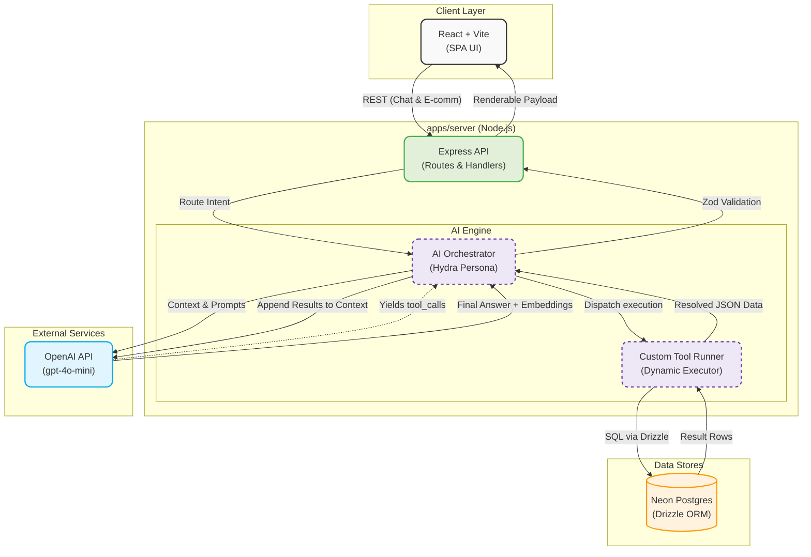

# [Arctic](https://arctic.hrsht.me/) - Smart Hydration E-Commerce

**Arctic** is an e-commerce application for premium hydration gear. It features a custom-built AI architecture, serving as a practical implementation of an LLM Tool Runner that handles product searches, order status checks, and personalized hydration advice through a chat interface. Built as a Turborepo monorepo, it features an Express backend, a React frontend, and a PostgreSQL database.

Built by [Harshit](https://www.hrsht.me).

Project live at [Arctic](https://arctic.hrsht.me)

## 🎥 Demo Video

<a href="https://youtu.be/mRuttj1RPNU" target="_blank">
  
</a>  
<p><b>Arctic- The Hydrabot Showcase</b> <a href="https://youtu.be/mRuttj1RPNU" target="_blank">Video ^^^</a></p>


---

## Table of Contents

1. [High-Level Architecture](#high-level-architecture)
2. [Tech Stack](#tech-stack)
3. [Project Structure](#project-structure)
4. [AI Architecture (Deep Dive)](#ai-architecture-deep-dive)
5. [Database & Persistence Strategy](#database--persistence-strategy)
6. [API Reference](#api-reference)
7. [Frontend Architecture](#frontend-architecture)
8. [Getting Started](#getting-started)
9. [Environment Variables](#environment-variables)
10. [Available Scripts](#available-scripts)

---

## High-Level Architecture


```mermaid
graph TD
    %% Styling Directives
    classDef client fill:#f9f9f9,stroke:#333,stroke-width:2px,rx:10,ry:10,color:#333;
    classDef server fill:#e2f0d9,stroke:#4caf50,stroke-width:2px,rx:10,ry:10,color:#333;
    classDef ai fill:#ede7f6,stroke:#673ab7,stroke-width:2px,rx:10,ry:10,stroke-dasharray: 5 5,color:#333;
    classDef db fill:#fff3e0,stroke:#ff9800,stroke-width:2px,rx:10,ry:10,color:#333;
    classDef external fill:#e1f5fe,stroke:#03a9f4,stroke-width:2px,rx:10,ry:10,color:#333;

    subgraph Client ["Client Layer"]
        FE["React + Vite<br/>(SPA UI)"]:::client
    end

    subgraph Backend ["apps/server (Node.js)"]
        API["Express API<br/>(Routes & Handlers)"]:::server
        
        subgraph AI_Engine ["AI Engine"]
            AI["AI Orchestrator<br/>(Hydra Persona)"]:::ai
            TR["Custom Tool Runner<br/>(Dynamic Executor)"]:::ai
        end
    end

    subgraph Data ["Data Stores"]
        PG[("Neon Postgres<br/>(Drizzle ORM)")]:::db
    end

    subgraph External ["External Services"]
        OAI["OpenAI API<br/>(gpt-4o-mini)"]:::external
    end

    %% Wiring
    FE -- "REST (Chat & E-comm)" --> API
    
    API -- "Route Intent" --> AI
    AI -- "Context & Prompts" --> OAI
    
    OAI -. "Yields tool_calls" .-> AI
    AI -- "Dispatch execution" --> TR
    
    TR -- "SQL via Drizzle" --> PG
    PG -- "Result Rows" --> TR
    TR -- "Resolved JSON Data" --> AI
    
    AI -- "Append Results to Context" --> OAI
    OAI -- "Final Answer + Embeddings" --> AI
    
    AI -- "Zod Validation" --> API
    API -- "Renderable Payload" --> FE
```

### End-to-End Data Flows

**AI Chat Loop:**
```
User asks: "What's the status of my latest order?"
  → POST /api/v1/ai/chat
  → Backend AI Module reads conversation history
  → Appends user message and calls OpenAI (MAX 5 iterations allowed)
  → LLM determines it needs order history and yields a tool_call: getOrderById
  → Tool Runner catches it, queries PostgreSQL for the specific user's latest order
  → Runner transforms DB rows directly into JSON context for the LLM
  → LLM synthesizes natural response ("Your order for Titanium Tumbler is out for delivery")
  → AI Orchestrator strictly validates output with Zod, ensures embeddings fit constraints
  → Frontend renders text and rich Interactive UI Cards (React) from the payload
```

**Personalized Hydration Recommendations:**
```
User (Logged In) asks: "What should I drink based on my lifestyle?"
  → Backend parses valid User Session via JWT/Cookies
  → Injects userId securely into Tool Runner (prevents arbitrary injection from LLM)
  → LLM calls getUserProfile tool
  → Runner pulls UserProfile (Activity Level, Climate, Goals) from DB
  → LLM formulates personalized advice and calls searchProducts tool for matches
  → Runner queries products DB based on criteria
  → Final LLM response returns text with rich product embeddings
```

---

## Tech Stack

| Technology | Role |
|---|---|
| **React 19 + Vite** | Frontend SPA, UI, routing |
| **Node.js + Express** | Backend API and AI orchestration |
| **Turborepo + pnpm** | Monorepo build and dependency management |
| **Neon (Serverless Postgres)** | Primary database (Users, Orders, Chat History) |
| **Drizzle ORM** | Type-safe SQL query builder |
| **OpenAI (`gpt-4o-mini`)** | Core language model for intent parsing and synthesis |
| **Zod** | Run-time schema validation and type safety |
| **Passport.js** | Authentication & Google OAuth integration |

---

## Project Structure

```
arctic/
├── apps/
│   ├── server/                 # Express REST API, AI Orchestration, Tool Runner
│   └── web/                    # React Vite SPA UI
│
├── packages/
│   ├── db/                     # Drizzle schema, migrations, typed DB client
│   ├── zod/                    # Shared validation schemas (e.g. aiResponseSchema)
│   ├── eslint-config/          # Shared linting rules
│   └── typescript-config/      # Shared TS configurations
```

---

## AI Architecture (Deep Dive)

**Arctic features a transparent, custom implementation of an LLM Tool Runner**, bypassing high-level abstraction frameworks to manage AI workflows directly.

The purpose of this project was to explore how Agentic AI works under the hood: demonstrating how an LLM decides *when* to fetch external context, *how* it parses intent, and *how* to safely inject private database information into the context window for Retrieval-Augmented Generation (RAG).

### 1. The Execution Loop
The `apps/server/src/ai/index.ts` orchestrates the loop:
- The system maintains context (System Prompt + History + Current Query).
- It operates a `while` loop, restricted to a **MAX of 5 iterations**, to prevent infinite execution loops and optimize API costs.
- It passes `tool_calls` down to the custom `Tool Runner` and loops back up with the resolved data until a final text answer is synthesized.

### 2. Context Boundaries and Roles
The AI assumes the "Hydra" persona and is guided to stay focused:
- It redirects topics unrelated to Arctic products, shipping, orders, or hydration.
- The system relies on structured outputs via OpenAI's `response_format: { type: "json_object" }` to ensure a consistent shape.

### 3. Graceful Fallbacks & Validation
Before leaving the backend, the raw LLM output is passed through Zod schema validation (`aiResponseSchema`). If the LLM returns markdown or misses required attributes, the backend suppresses the error and serves a standard fallback directly to the user to maintain a reliable UI experience.

### 4. Dynamic UI Rendering (Embeddings)
The system prompt instructs the LLM to output a dedicated array of `embeddings` alongside its conversational text. The orchestrator limits this list to a maximum of 6 elements. The React frontend then consumes these IDs and mounts interactive functional UI components (Product Cards, Order Widgets) dynamically for the user.

---

## Database & Persistence Strategy

### PostgreSQL (via Drizzle ORM)
Connected to a Neon database, acting as the singular source of truth:
- **`products` & `orders` tables**: E-commerce entities for catalog rendering and transactional queries.
- **`users` & `user_profiles` tables**: Authentication and hydration-specific profile data (Climate, Activity) for customized AI support.
- **`conversation` & `messages` tables**: Chat histories are stored relationally here. This allows the backend to fetch the conversational log and construct LLM windows without needing secondary vector databases or isolated prompt logs.

---

## API Reference

### Real-time AI
| Method | Path | Description |
|---|---|---|
| `POST` | `/api/v1/ai/chat` | Main interface for interacting with the Hydra support bot |

### Auth & User
| Method | Path | Description |
|---|---|---|
| `GET` | `/api/v1/auth/google` | Trigger Google OAuth flow |
| `GET` | `/api/v1/user/profile` | Retrieve the hydration `user_profile` |
| `PUT` | `/api/v1/user/profile` | Upsert the user profile properties |

### E-Commerce
| Method | Path | Description |
|---|---|---|
| `GET` | `/api/v1/products` | Fetch full item catalog |
| `GET` | `/api/v1/orders` | Fetch user order history |

---

## Frontend Architecture

**Framework:** React 19 / Vite SPA

| Concept | Purpose |
|---|---|
| **Routing** | React Router v7 |
| **Styling** | Tailwind CSS v4 |
| **State Management** | Zustand (global UI states) and React Query (fetching and caching REST APIs, including AI conversation handling). |
| **Interactive Chat UI** | Dynamically mounts rich card components into the message feed directly using JSON embedding arrays output by the backend. |

---

## Getting Started

### Prerequisites

- Node.js ≥ 20
- pnpm ≥ 9
- Neon Postgres database (or local Postgres server)
- OpenAI API Key

### Installation

```bash
git clone https://github.com/iBreakProd/Arctic-Support-Agent.git
cd Arctic-Support-Agent
pnpm install
```

### Database Setup

```bash
pnpm --filter @repo/db db:push # Make sure to generate and apply Drizzle changes
```

### Development

```bash
# Run all apps concurrently via Turborepo
pnpm dev
```

### Production Build

```bash
pnpm build
```

---

## Environment Variables

A combination of global and app-specific variables. Provide `.env` files in root or respective app directories.

| Variable | Description |
|---|---|
| `DATABASE_URL` | Neon/Postgres connection string |
| `FRONTEND_URL` | Allowed origin for CORS (e.g., http://localhost:5173) |
| `HTTP_PORT` | Backend Express Port (Default 3000) |
| `OPENAI_API_KEY` | GPT-4o-mini authentication key |
| `JWT_SECRET` | Secret for signing JWTs/Cookies |
| `GOOGLE_CLIENT_ID` | OAuth Client ID |
| `GOOGLE_CLIENT_SECRET` | OAuth Client Secret |

---

## Available Scripts

| Script | Command | Description |
|---|---|---|
| `dev` | `pnpm dev` | Run all apps in watch mode |
| `build` | `pnpm build` | Compile all packages and apps |
| `start` | `pnpm start` | Run compiled backend app |
| `lint` | `pnpm lint` | Run ESLint across packages |
| `db:push` | `pnpm --filter @repo/db db:push` | Push schema directly to DB |

---

## About the Builder

**Harshit** is a software engineer passionate about building intelligent systems and creating seamless user experiences.

**Website**: [hrsht.me](https://hrsht.me)  
**LinkedIn**: [in/ibreakprod](https://www.linkedin.com/in/ibreakprod/)  
**X (Twitter)**: [@I_Break_Prod](https://x.com/I_Break_Prod)  
**GitHub**: [@iBreakProd](https://github.com/iBreakProd)
